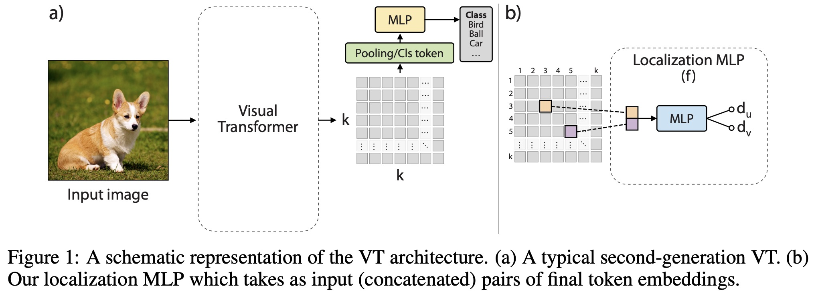

# Efficient Training of Visual Transformers with Small Datasets

[]((https://github.com/yhlleo/VTs-Drloc/graphs/commit-activity))




To appear in [NerIPS 2021](https://nips.cc/).

[[paper]](https://proceedings.neurips.cc/paper/2021/file/c81e155d85dae5430a8cee6f2242e82c-Paper.pdf)[[Poster & Video]](https://nips.cc/virtual/2021/poster/27009)[[arXiv]](https://arxiv.org/pdf/2106.03746.pdf)[[code]](https://github.com/yhlleo/VTs-Drloc) [[reviews]](https://openreview.net/forum?id=AJofO-OFT40) <br>
[Yahui Liu](https://yhlleo.github.io/)<sup>1,3</sup>, [Enver Sangineto](https://scholar.google.com/citations?user=eJZlvlAAAAAJ&hl=it)<sup>1</sup>, [Wei Bi](https://scholar.google.com/citations?user=aSJcgQMAAAAJ&hl=en)<sup>2</sup>, [Nicu Sebe](https://scholar.google.com/citations?user=stFCYOAAAAAJ&hl=en)<sup>1</sup>,  [Bruno Lepri](https://scholar.google.com/citations?hl=en&user=JfcopG0AAAAJ)<sup>3</sup>, [Marco De Nadai](https://scholar.google.com/citations?user=_4-U61wAAAAJ&hl=en)<sup>3</sup> <br>
<sup>1</sup>University of Trento, Italy, <sup>2</sup>Tencent AI Lab, China, <sup>3</sup>Bruno Kessler Foundation, Italy. <br>

### Data preparation

|Dataset|Download Link|
|:-----|:-----|
|[ImageNet](https://www.image-net.org/)|[train](http://www.image-net.org/data/ILSVRC/2012/ILSVRC2012_img_train.tar),[val](http://www.image-net.org/data/ILSVRC/2012/ILSVRC2012_img_val.tar)|
|[CIFAR-10](https://www.cs.toronto.edu/~kriz/cifar.html)|[all](https://www.cs.toronto.edu/~kriz/cifar-10-python.tar.gz)|
|[CIFAR-100](https://www.cs.toronto.edu/~kriz/cifar.html)|[all](https://www.cs.toronto.edu/~kriz/cifar-100-python.tar.gz)|
|[SVHN](http://ufldl.stanford.edu/housenumbers/)|[train](http://ufldl.stanford.edu/housenumbers/train_32x32.mat),[test](http://ufldl.stanford.edu/housenumbers/test_32x32.mat), [extra](http://ufldl.stanford.edu/housenumbers/extra_32x32.mat)|
|[Oxford-Flower102](https://www.robots.ox.ac.uk/~vgg/data/flowers/102/)|[images](https://www.robots.ox.ac.uk/~vgg/data/flowers/102/102flowers.tgz), [labels](https://www.robots.ox.ac.uk/~vgg/data/flowers/102/imagelabels.mat), [splits](https://www.robots.ox.ac.uk/~vgg/data/flowers/102/setid.mat)|
|[Clipart](http://ai.bu.edu/M3SDA/)|[images](http://csr.bu.edu/ftp/visda/2019/multi-source/groundtruth/clipart.zip), [train_list](http://csr.bu.edu/ftp/visda/2019/multi-source/domainnet/txt/clipart_train.txt), [test_list](http://csr.bu.edu/ftp/visda/2019/multi-source/domainnet/txt/clipart_test.txt)|
|[Infograph](http://ai.bu.edu/M3SDA/)|[images](http://csr.bu.edu/ftp/visda/2019/multi-source/infograph.zip), [train_list](http://csr.bu.edu/ftp/visda/2019/multi-source/domainnet/txt/infograph_train.txt), [test_list](http://csr.bu.edu/ftp/visda/2019/multi-source/domainnet/txt/infograph_test.txt)|
|[Painting](http://ai.bu.edu/M3SDA/)|[images](http://csr.bu.edu/ftp/visda/2019/multi-source/groundtruth/painting.zip), [train_list](http://csr.bu.edu/ftp/visda/2019/multi-source/domainnet/txt/painting_train.txt), [test_list](http://csr.bu.edu/ftp/visda/2019/multi-source/domainnet/txt/painting_test.txt)|
|[Quickdraw](http://ai.bu.edu/M3SDA/)|[images](http://csr.bu.edu/ftp/visda/2019/multi-source/quickdraw.zip), [train_list](http://csr.bu.edu/ftp/visda/2019/multi-source/domainnet/txt/quickdraw_train.txt), [test_list](http://csr.bu.edu/ftp/visda/2019/multi-source/domainnet/txt/quickdraw_test.txt)|
|[Real](http://ai.bu.edu/M3SDA/)|[images](http://csr.bu.edu/ftp/visda/2019/multi-source/real.zip), [train_list](http://csr.bu.edu/ftp/visda/2019/multi-source/domainnet/txt/real_train.txt), [test_list](http://csr.bu.edu/ftp/visda/2019/multi-source/domainnet/txt/real_test.txt)|
|[Sketch](http://ai.bu.edu/M3SDA/)|[images](http://csr.bu.edu/ftp/visda/2019/multi-source/sketch.zip), [train_list](http://csr.bu.edu/ftp/visda/2019/multi-source/domainnet/txt/sketch_train.txt), [test_list](http://csr.bu.edu/ftp/visda/2019/multi-source/domainnet/txt/sketch_test.txt)|

 - Download the datasets and pre-processe some of them (i.e., imagenet, [domainnet](http://ai.bu.edu/M3SDA/)) by using codes in the `scripts` folder.
 - The datasets are prepared with the following stucture (except CIFAR-10/100 and SVHN):

```
dataset_name
  |__train
  |    |__category1
  |    |    |__xxx.jpg
  |    |    |__...
  |    |__category2
  |    |    |__xxx.jpg
  |    |    |__...
  |    |__...
  |__val
       |__category1
       |    |__xxx.jpg
       |    |__...
       |__category2
       |    |__xxx.jpg
       |    |__...
       |__...
```

### Training 

After prepare the datasets, we can simply start the training with 8 NVIDIA V100 GPUs:

```
sh train.sh
```

### Evaluation 

We can also load the pre-trained model and test the performance:

```
sh eval.sh
```

### Pretrained models

For fast evaluation, we present the results of Swin-T trained with 100 epochs on various datasets as an example (Note that we save the model every 5 epochs during the training, so the attached best models may be slight different from the reported performances).

|Datasets|Baseline|Ours|
|:----|:----|:----|
|CIFAR-10|59.47|83.89|
|CIFAR-100|53.28|66.23|
|SVHN|71.60|94.23|
|Flowers102|34.51|39.37|
|Clipart|38.05|47.47|
|Infograph|8.20|10.16|
|Painting|35.92|41.86|
|Quickdraw|24.08|69.41|
|Real|73.47|75.59|
|Sketch|11.97|38.55|

We provide a demo to download the pretrained models from Google Drive directly:

```
python3 ./scripts/collect_models.py
```

### Related Work:

 - [Swin-Transformer](https://github.com/microsoft/Swin-Transformer)
 - [CvT](https://github.com/microsoft/CvT)
 - [T2T-ViT](https://github.com/yitu-opensource/T2T-ViT)
 - [ViT](https://github.com/lucidrains/vit-pytorch)


### Acknowledgments 

This code is highly based on the [Swin-Transformer](https://github.com/microsoft/Swin-Transformer). Thanks to the contributors of this project.

### Citation

```
@InProceedings{liu2021efficient,
    author    = {Liu, Yahui and Sangineto, Enver and Bi, Wei and Sebe, Nicu and Lepri, Bruno and De Nadai, Marco},
    title     = {Efficient Training of Visual Transformers with Small Datasets},
    booktitle = {Conference on Neural Information Processing Systems (NeurIPS)},
    year      = {2021}
}
```

If you have any questions, please contact me without hesitation (yahui.cvrs AT gmail.com).


